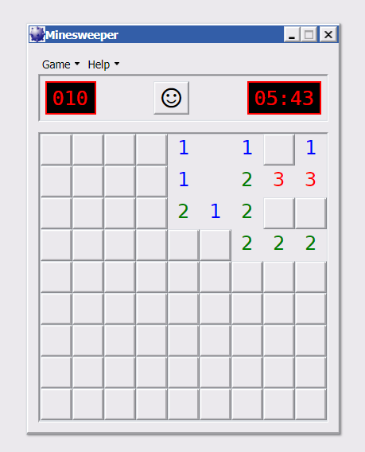

# Qooxdoo Minesweeper

## Gameplay

Minesweeper is a puzzle video game. In the game, mines (that resemble naval mines in the classic theme) are scattered throughout a board, which is divided into cells. Cells have three states: unopened, opened and flagged. An unopened cell is blank and clickable, while an opened cell is exposed. Flagged cells are unopened cells marked by the player to indicate a potential mine location; flagged cells unopenable to reduce the risk of uncovering a suspected mine.

A player selects a cell to open it. If a player opens a mined cell, the game ends in a loss. Otherwise, the opened cell displays either a number, indicating the number of mines diagonally and/or adjacent to it, or a blank tile (or "0"), and all adjacent non-mined cells will automatically be opened. Players can also flag a cell, visualised by a flag being put on the location, to denote that they believe a mine to be in that place. Flagged cells are still considered unopened, and may be unflagged.